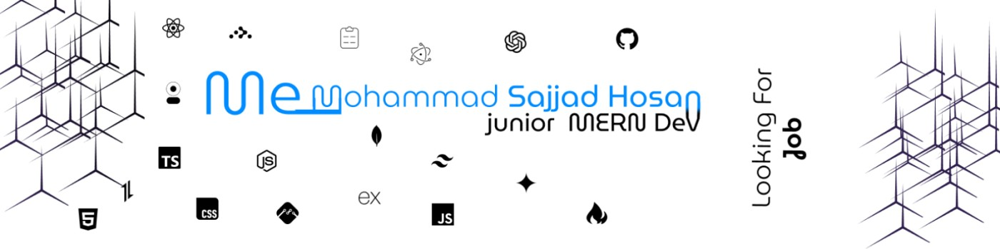

<p align="center">
  <a href="https://dev-sajjadhosan.github.io" target="_blank">
     
  </a>
</p>


<p align="center">
Assakamu Alaikum
</p>
<i>
<h1 align="center">I' me Mohammad Sajjad Hosan 👋</h1>
</i>
<p align="center">
  MERN Stack Developer · Code Alchemist · Based in 🇧🇩 Bangladesh  
  <br/>
  Passionate about turning ideas into interactive realities
</p>

<p align="center">
    
<a href="https://mohammadsajjadhosan.vercel.app">
    
  </a>
</p>
<p align="center">
  <a href="mailto:devsajjadhosan@gmail.com">
    
  </a>
  <a href="https://www.linkedin.com/in/devsajjadhosan">
    
  </a>
  <a href="https://github.com/dev-sajjadhosan">
    
  </a>
  <a href="https://web.facebook.com/MohammadSajjadHosan0">
    
  </a>
</p>

```ts
// 🧠 Developer Brain.exe

while (true) {
  let idea = getRandomIdea();
  if (isGenius(idea)) {
    build(idea);
    break;
  } else {
    overthink(idea);
    getSnacks();
  }
}
```

###  About Me
```

- 🔧 **Self-taught full-stack developer** with a love for clean code & design
- 🧠 Specializing in **MERN, TypeScript, Firebase**, and now exploring **3D Web + AI**
- 🤝 I build with a **user-first** mindset and enjoy collaborating with communities
- 💬 Curious about my work or journey? [Open an issue](https://github.com/dev-sajjadhosan/issues)

```

### My Hobbies

```ts

    - Create Unique Design & Logic Coding
    - Explore new Tech & Learn it Quickly
    - Love to build Open-Source Project
```

## 🛠 Tech Toolbox

## 💻 Frontend

<table align="center">
  <tr>
    <td align="center" width="120">
      <br/>HTML5
    </td>
    <td align="center" width="120">
      <br/>CSS3
    </td>
    <td align="center" width="120">
      <br/>JavaScript
    </td>
    <td align="center" width="120">
      <br/>TypeScript
    </td>
  </tr>
  <tr>
    <td align="center" width="120">
      <br/>React.js
    </td>
    <td align="center" width="120">
      <br/>Next.js
    </td>
    <td align="center" width="120">
      <br/>TailwindCSS
    </td>
    <td align="center" width="120">
      <br/>Electron
    </td>
  </tr>
</table>


## 🔧 Backend

<table align="center">
  <tr>
    <td align="center" width="120">
      <br/>Node.js
    </td>
    <td align="center" width="120">
      <br/>Express.js
    </td>
    <td align="center" width="120">
      <br/>MongoDB
    </td>
    <td align="center" width="120">
      <br/>Firebase
    </td>
  </tr>
  <tr>
    <td align="center" width="120">
      <br/>Socket.IO
    </td>
  </tr>
</table>


## ☁️ Hosting / DevOps

<table align="center">
  <tr>
    <td align="center" width="120">
      <br/>Vercel
    </td>
    <td align="center" width="120">
      <br/>Firebase
    </td>
    <td align="center" width="120">
      <br/>Render
    </td>
  </tr>
</table>


## 🛠 Tools & Others

<table align="center">
  <tr>
    <td align="center" width="120">
      <br/>Git
    </td>
    <td align="center" width="120">
      <br/>GitHub
    </td>
    <td align="center" width="120">
      <br/>VS Code
    </td>
    <td align="center" width="120">
      <br/>Postman
    </td>
  </tr>
</table>

## 📌 Career Highlights
```
- 🧩 Built **real-world full-stack projects** with real feedback
- 📦 Designed **reusable UI components & REST APIs**
- 🤲 Actively contribute to **open-source projects & dev communities**
```

## 📊 GitHub Stats

<p align="center">
  
  
</p>


## 💡 Fun Facts
```
- 🎮 I love building **tools that feel like games**
- 🧪 I intentionally break stuff… just to **rebuild smarter**
- 🌍 My dream: **build something millions use — useful, open, and beautiful**
```

```
<p align="center"><em>"Code like art. Design like it speaks. Ship like it's alive."</em></p>
```


