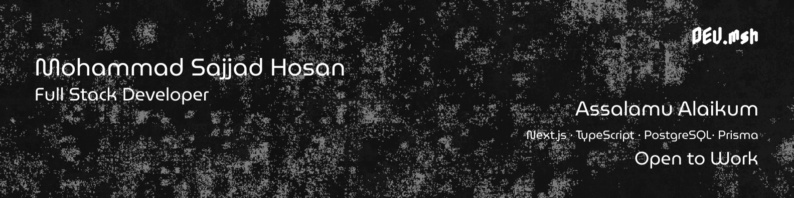

 

### I'm a self-taught 🧑‍💻 passionate MERN developer from Bangladesh 🇮🇳 ⬇️

 

# About me 🧐

- 👋 Greeting Visitor,
- 💻 A developer who codes for the joy of creating.
- 🎯 While I code for fun, I find purpose in helping others through my work.
- 🛠️ I build projects people can use, enjoy, and grow with.
- 🌍 For public work, the user always comes first — without them, the project has no meaning.
  -🧠 I welcome feedback and see every suggestion as a step toward better solutions.

- 💬 Ask me about anything [here](https://github.com/dev-sajjadhosan/issues)

 
 

## My Achivements 😏

  
  
  
    

  
  
 
  

 
 

## Github Status 🧑‍💻

|  |  |
| -------------------------------------------------------------------------------------------------------------------------------------------------------------------------------------------------------------- | -------------------------------------------------------------------------------------------------------------------------------------------------------------------------------- |

<!-- #### Top Repositories -->

<!--  -->

 
 

## Contact me 😎

  <!--  -->
  <!-- 
  
  
   -->

  <!--  -->
  <!--  -->
  <!--  -->
