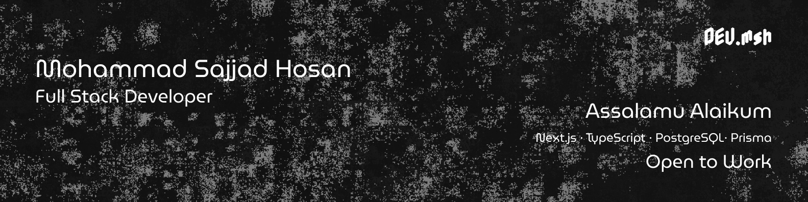

<br/>
<br/>
<p align="center">
  <a href="https://dev-sajjadhosan.github.io" target="_blank">
     
  </a>
</p>

<h3 align="center">
Assakamu Alaikum
</h3>
<i>
<h1 align="center">I'm Mohammad Sajjad Hosan 👋</h1>
</i>
<h4 align="center">
  Full Stack Developer (Next.js · Node.js · TypeScript)  
  <br/>
  Building scalable, production-ready web applications
</h4>

<p align="center">
    
<a href="https://mohammadsajjadhosan.vercel.app">
    
  </a>
  <a href="mailto:devsajjadhosan@gmail.com">
    
  </a>
  <a href="https://www.linkedin.com/in/devsajjadhosan">
    
  </a>
  <a href="https://github.com/dev-sajjadhosan">
    
  </a>
  <a href="https://web.facebook.com/MohammadSajjadHosan0">
    
  </a>
</p>

### About Me

```
Assalamu Alaikum!

I'm a Full Stack Developer who enjoys building things — not just making them work, but making them work well.

My journey started with curiosity and grew into a craft I take seriously every day. Late-night debugging, production deployment battles, moments where everything finally clicked — every one of them made me a sharper developer.

What makes me a little different — I don't just work in software. Mobile servicing, PC repair, and electronics have taught me to think at the system level, not just the screen level. When you understand both the software and the machine running it, you debug differently. You think differently.

I explore what others have built to spark new ideas, then turn that inspiration into something creative and uniquely my own. I'm not interested in copy-pasting solutions — I'm interested in understanding them deeply and making something better.

I contribute to open source because I believe in building in public and giving back to the community that helped me grow.

```

### 🛠️ What I Work With

```
### 🛠️ Tech Stack

#### 🚀 Frontend
Next.js · React · TypeScript
Tailwind CSS · shadcn/ui · DaisyUI
TanStack Query · Zustand

#### ⚙️ Backend
Node.js · Express
Prisma ORM · Mongoose

#### 🗄️ Databases
PostgreSQL · MongoDB · Firebase

#### 🔐 Authentication & Security
JWT · Better Auth

#### 💳 Payments & Realtime
Stripe · Socket.IO

#### 🧰 DevOps & Tools
Docker · Vercel · Render
Git · GitHub

#### 🧪 Validation & Utilities
Zod

```

### 🎯 What Drives Me

```
✦ Problem solving — I sit with hard bugs until I understand them

✦ User-focused products — I build for the person on the other side

✦ Clean, readable code — because the next developer matters too

✦ Purposeful building — if it doesn't benefit the user, I question it
```

### 🚀 Where I'm Headed

```
Early-stage Full Stack Developer focused on building production-ready applications with modern web technologies. — but I think clearly about where I'm going. I want to grow into a Software Architect, build my own SaaS product, lead a team, and contribute to open source projects that matter.

The goal isn't just a job. It's to become the kind of developer whose work speaks before they do.
```

### 🌍 What I'm Looking For

```
I'm looking for a remote Full Stack Developer role where I can contribute from day one and build products that actually matter to people.

If you're building something meaningful — let's talk.
```

<!-- ## 📊 GitHub Stats -->

<!-- <p align="center">
  
  
</p> -->
